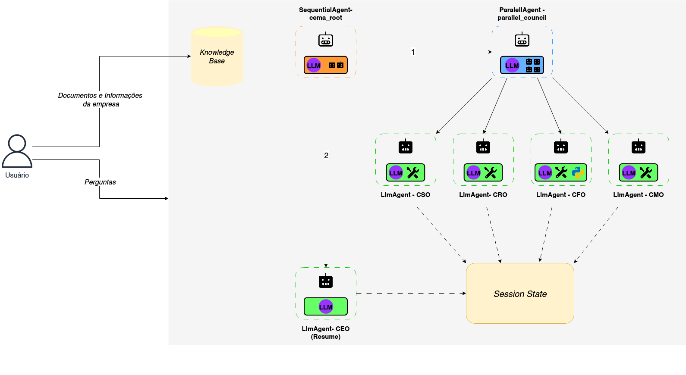

# CEMA - Multi-Agent Executive Council

Strategic Decision Support System based on Multi-Agent Artificial Intelligence for Social Enterprises and ESG Consultancies.

Developed as a Bachelor's Thesis for the **Bachelor of Computer Science** at **IFSUL Passo Fundo Campus**.

## 🎯 About the Project

CEMA simulates an executive council with 5 specialist agents analyzing strategic dilemmas:

- **👥 CSO** - Chief Social Officer (Social Impact)
- **📊 CMO** - Chief Marketing Officer (Market and Competition)
- **💰 CFO** - Chief Financial Officer (Financial Viability)
- **⚖️ CRO** - Chief Risk Officer (SWOT Risk Analysis)
- **🎯 CEO** - Chief Executive Officer (Synthesis and Final Decision)

  

**Architecture:** Hybrid Multi-Agent System (Parallel + Sequential)

## 🚀 Setup

Check the respective README.md files.

### Backend (Multi-Agent System)
See backend/README.md

### Frontend (Web Interface)
See frontend/README.md

### Synthetic Data Generation (Optional)
See synthetic-data-generation/README.md

## 🔧 Tech Stack

| Component | Technology | Cost |
|------------|------------|-------|
| **LLM** | Google Gemini 2.5 Flash/Pro | Free tier |
| **Multi-Agent Framework** | Google ADK | Open-source |
| **Backend Deploy** | Railway | ~$0-5/month |
| **Frontend** | Streamlit + Streamlit Cloud | Free |
| **Synthetic Data** | Ollama with Gemma-3-Gaia-PT-BR | Open-source |

**Total cost to run locally:** R$ 0.00  
**Total deployed cost:** R$ 0-5/month

## 👨‍💻 Author

**Natthan Elias** [LinkedIn](https://www.linkedin.com/in/natthan-elias/)

## 📄 License

Educational material free for academic use.
